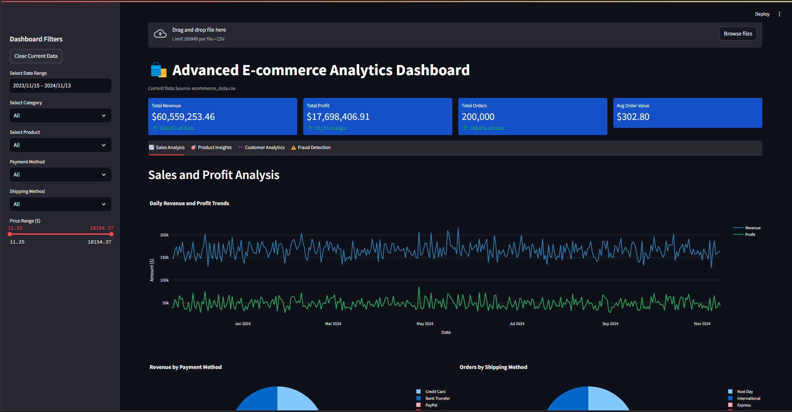

# E-commerce Transaction Data Generator and Dashboard

This project generates synthetic e-commerce transaction data and visualizes it through a Streamlit-based dashboard for advanced analytics. The dashboard provides insights into sales, product performance, customer behavior, and fraud detection based on the generated data.

## Table of Contents
- [Project Overview](#project-overview)
- [Installation](#installation)
- [Usage](#usage)
- [Data Generation](#data-generation)
- [Dashboard](#dashboard)
- [Features](#features)
- [Contributing](#contributing)
- [License](#license)

## Project Overview
The project consists of two main components:
1. **Data Generation**: A Python script that generates synthetic e-commerce transaction data, including product categories, prices, customer details, payment methods, and more.
2. **Dashboard**: A Streamlit web app that loads the generated data and displays it in an interactive dashboard, providing metrics and visualizations for business insights.

## Installation

### Prerequisites
Make sure you have Python 3.7+ installed. You'll also need the following dependencies:
- `pandas`
- `numpy`
- `faker`
- `plotly`
- `streamlit`

You can install them using `pip`:

```bash
pip install pandas numpy faker plotly streamlit
```

alternatively, you can install them using the `requirements.txt` file:

```bash
pip install -r requirements.txt
```

### Clone the Repository
```bash
git clone https://github.com/AbhishekT-2002/Ecommerce-Dashboard-Streamlit-App
cd https://github.com/AbhishekT-2002/Ecommerce-Dashboard-Streamlit-App
```

## Usage

### 1. Data Generation
To generate synthetic transaction data, run the following Python script:

```bash
python data_generation.py
```

This will create a CSV file (`ecommerce_data.csv`) with the synthetic data.

### 2. Dashboard
To run the dashboard, use the following Streamlit command:

```bash
streamlit run dashboard_app.py
```

This will launch the Streamlit app in your default web browser. Usually you can access it at http://localhost:8501/.

### 3. Loading Data
To load the generated csv file, click on browse file and upload the generated csv file with default name `ecommerce_data.csv` stored in the same path as `data_generation.py` script.


### 4. Filters
Use the various filters and options to visualise and analyze the data for information and patterns such as:
- Date range
- Product category
- Product name
- Payment method


### 5. Cache
This streamlit app supports caching of data to optimize performance. The cache is stored in the `dashboard_cache` directory. in order to clear the cache you can click the `clear cache` button on the sidebar.

### 6.  Demo Video
Still not sure how to use it? check out this demo video on youtube here:
[Demo Video](https://www.youtube.com/watch?v=LrlCw677w5g)

## Data Generation
The synthetic data includes the following fields:
- `order_id`: A unique identifier for each order.
- `transaction_date`: The date and time when the transaction occurred.
- `customer_id`: A unique identifier for each customer.
- `customer_name`: The name of the customer.
- `email`: The email address of the customer.
- `category`: The product category (e.g., Electronics, Clothing, Home).
- `product_name`: The specific product name.
- `quantity`: The quantity of the product purchased.
- `base_price`: The original price of the product.
- `discount`: The discount applied, if any.
- `total_price`: The final price after applying the discount.
- `cost`: The cost of the product to the seller.
- `profit`: The profit made on the transaction.
- `coupon_code`: A coupon code applied to the transaction.
- `payment_method`: The method used for payment (e.g., Credit Card, PayPal).
- `shipping_method`: The shipping method used (e.g., Standard, Express).
- `shipping_address`: The shipping address for the order.
- `ip_address`: The IP address of the customer.

### Data Filters:
The dashboard allows users to filter the data by:
- Date range
- Product category
- Product name
- Payment method
- Shipping method
- Price range

## Dashboard
The dashboard consists of several sections:

1. **Key Metrics**: Displays key statistics such as total revenue, total profit, total orders, and average order value.
2. **Sales and Profit Analysis**: Visualizes daily revenue and profit trends and shows payment and shipping method distributions.
3. **Product and Category Analysis**: Displays product category distributions, top-selling products by quantity, and profit.
4. **Customer Analytics**: Provides insights into customer behaviors, including total customers, repeat customers, and top spenders.
5. **Fraud Detection**: Analyzes suspicious transactions, with potential fraud alerts based on predefined criteria.

## Features
- **Interactive visualizations**: Use Plotly charts for better insights.
- **Customizable filters**: Filter data by date range, product categories, and other factors.
- **Real-time updates**: The dashboard updates based on user-selected filters.
- **Cache system**: To optimize performance, previously loaded data is cached locally.

## Contributing
Feel free to fork this repository, create a new branch, and submit a pull request with your improvements. Please follow best practices when submitting code and write clear commit messages.

## License
This project is licensed under the MIT License - see the [LICENSE](https://opensource.org/license/mit) file for details.
